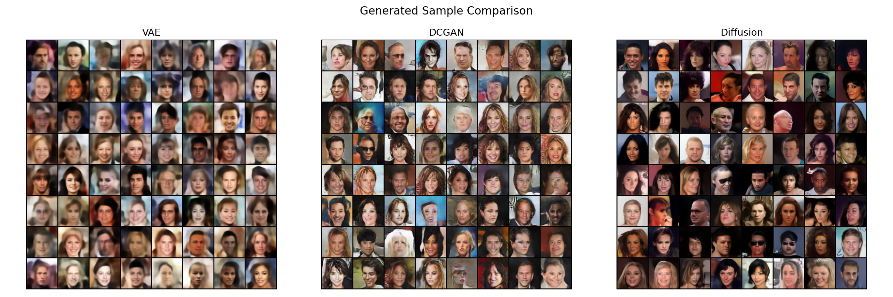
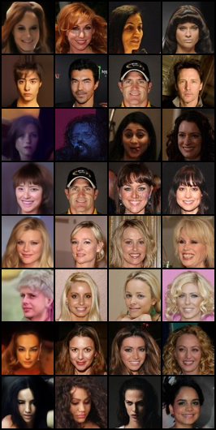

# CelebA Generative Model Comparison App

An end-to-end generative deep learning project comparing **VAE**, **tuned DCGAN**, and **DDPM-style diffusion models** for synthetic face generation on the CelebA dataset.

The project includes data preparation, model training, generated image comparison, training-curve analysis, nearest-neighbour memorisation checking, and an interactive Streamlit dashboard.

---

## Project Overview

This project investigates how different generative model families learn and generate face-like images from the CelebA dataset.

Three models are implemented and compared:

| Model | Role |
|---|---|
| Variational Autoencoder | Stable latent-space baseline |
| Tuned DCGAN | Adversarial image-generation baseline |
| Diffusion Model | Main modern generative model |

The project compares the models based on:

- generated sample quality
- training behaviour
- visual diversity
- model limitations
- nearest-neighbour memorisation check
- dashboard presentation

---

## Final Result Summary

The final comparison shows a clear difference between the three model types:

| Model | Main Strength | Main Limitation |
|---|---|---|
| VAE | Stable training and learns broad face structure | Blurry generated outputs |
| Tuned DCGAN | Sharper and more textured outputs than VAE | Training instability and visual artifacts |
| Diffusion | Best visual quality, diversity, and stability | Slower sampling and heavier training |

Overall, the diffusion model produced the strongest generated samples in this project.

---

## Generated Sample Comparison

The figure below compares generated samples from the three trained models.



---

## Streamlit Dashboard

The project includes a Streamlit dashboard for interactive result exploration.

Dashboard pages include:

1. Project Overview
2. Dataset Explorer
3. Generate & Compare
4. Training Curves
5. Evaluation Metrics
6. Nearest-Neighbour Check
7. Ethics & Limitations

The dashboard runs in lightweight demo mode using saved result figures and public CSV summaries. This means it can be viewed without requiring GPU inference.

To run the dashboard locally:

```bash
streamlit run app/streamlit_app.py
```

---

## Dataset

This project uses the CelebA face dataset.

The full dataset is not included in this repository because it is large and contains real human face images.

Expected local structure:

```text
data/
  raw/
    celeba/
      img_align_celeba/
      list_attr_celeba.csv
      list_bbox_celeba.csv
      list_eval_partition.csv
      list_landmarks_align_celeba.csv
```

Processed images are saved locally under:

```text
data/
  processed/
    celeba_64/
      train/
      val/
      test/
```

Only small selected figures are included publicly in the repository.

For more details, see:

```text
data/README.md
```

---

## Project Pipeline

```text
CelebA dataset
    ↓
Preprocessing to 64x64 RGB images
    ↓
Train VAE baseline
    ↓
Train tuned DCGAN baseline
    ↓
Train diffusion model
    ↓
Generate synthetic face samples
    ↓
Compare visual quality and training behaviour
    ↓
Run nearest-neighbour memorisation check
    ↓
Build Streamlit dashboard
```

---

## Models

### 1. Variational Autoencoder

The VAE learns a compressed latent representation of face images.

It is used as the first baseline because it is stable, interpretable, and useful for understanding latent-space generation.

Expected behaviour:

- stable training
- smooth generated samples
- blurry outputs
- useful baseline for comparison

---

### 2. Tuned DCGAN

The DCGAN uses two neural networks:

- a generator that creates fake images
- a discriminator that distinguishes real and fake images

The tuned DCGAN includes:

- one-sided label smoothing
- lower discriminator learning rate
- instance noise during early training

These changes were added because the first DCGAN run showed low diversity and discriminator dominance.

Expected behaviour:

- sharper samples than VAE
- more texture and visual detail
- less stable training
- possible artifacts and distortions

---

### 3. Diffusion Model

The diffusion model learns to generate images by reversing a noising process.

Training process:

```text
clean image → add noise → model predicts noise
```

Generation process:

```text
random noise → repeated denoising → generated face
```

The diffusion model produced the best visual results in this project.

Expected behaviour:

- stable noise-prediction training
- clearer face structure
- stronger visual diversity
- slower sampling than VAE and DCGAN

---

## Training Results

### VAE

The VAE trained smoothly over 30 epochs. Both training and validation loss decreased steadily.

Main result:

```text
stable but blurry generated samples
```

### Tuned DCGAN

The tuned DCGAN generated sharper and more detailed samples than the VAE, but the training curves showed typical adversarial instability.

Main result:

```text
sharper but less stable
```

### Diffusion

The diffusion model showed stable loss behaviour and produced the strongest visual results.

Main result:

```text
best overall generated sample quality
```

---

## Nearest-Neighbour Check

Because CelebA contains real human face images, this project includes a nearest-neighbour check.

The check compares generated diffusion samples against visually similar real training images.



This is a qualitative memorisation check. It does not prove identity-level similarity, but it helps inspect whether generated samples appear to copy training images too closely.

---

## Repository Structure

```text
celeba-generative-comparison/
│
├── README.md
├── requirements.txt
├── config.yaml
├── .gitignore
│
├── data/
│   ├── README.md
│   ├── raw/
│   ├── interim/
│   ├── processed/
│   └── samples/
│
├── notebooks/
│   ├── dataset_preparation.ipynb
│   ├── exploratory_analysis.ipynb
│   ├── vae_baseline.ipynb
│   ├── dcgan_baseline.ipynb
│   ├── diffusion_model.ipynb
│   ├── model_evaluation.ipynb
│   └── app_demo_test.ipynb
│
├── src/
│   ├── data/
│   ├── models/
│   ├── training/
│   ├── inference/
│   ├── evaluation/
│   └── utils/
│
├── app/
│   ├── streamlit_app.py
│   ├── app_utils.py
│   └── pages/
│
├── scripts/
│   ├── prepare_data.py
│   ├── train_vae.py
│   ├── train_dcgan.py
│   ├── train_diffusion.py
│   ├── generate_samples.py
│   └── evaluate_models.py
│
├── reports/
│   ├── figures/
│   └── tables/
│
├── checkpoints/
├── outputs/
└── runs/
```

---

## Setup

Create a virtual environment:

```bash
python -m venv .venv
```

Activate it on Windows:

```bash
.venv\Scripts\activate
```

Install dependencies:

```bash
pip install -r requirements.txt
```

---

## Running the Project

### 1. Prepare the Dataset

```bash
python scripts/prepare_data.py
```

For a quick test:

```bash
python scripts/prepare_data.py --limit 1000
```

---

### 2. Train VAE

```bash
python scripts/train_vae.py --epochs 30
```

---

### 3. Train DCGAN

```bash
python scripts/train_dcgan.py --epochs 30
```

---

### 4. Train Diffusion Model

```bash
python scripts/train_diffusion.py --epochs 30
```

---

### 5. Generate Sample Grids

```bash
python scripts/generate_samples.py --model all --num-images 64 --seed 42 --inference-steps 50
```

---

### 6. Evaluate Models

```bash
python scripts/evaluate_models.py
```

Run nearest-neighbour check:

```bash
python scripts/evaluate_models.py --nearest-neighbor --num-generated 8 --num-neighbors 3 --max-real-images 5000
```

---

### 7. Run Streamlit Dashboard

```bash
streamlit run app/streamlit_app.py
```

---

## Public vs Local Files

The repository includes code, notebooks, selected figures, and lightweight result tables.

The following files are local-only and should not be committed:

```text
data/raw/
data/processed/
checkpoints/
outputs/
runs/
```

The following files are safe to commit:

```text
reports/figures/
reports/tables/
notebooks/
src/
scripts/
app/
```

---

## Ethics and Limitations

This project is for educational generative modelling only.

The generated samples should be treated as synthetic images and should not be used for:

- impersonation
- identity manipulation
- misleading media
- misinformation
- face-based profiling

CelebA contains real human face images, so responsible presentation and memorisation checking are important parts of this project.

---

## Future Work

Possible future improvements:

- Add FID/KID quantitative metrics
- Add attribute-conditioned generation using CelebA labels
- Add local live inference mode in the Streamlit app
- Deploy the lightweight dashboard publicly
- Use perceptual or face-embedding features for stronger memorisation checking
- Train higher-resolution models at 128x128

---

## Current Status

Completed:

- dataset preparation pipeline
- VAE baseline
- tuned DCGAN baseline
- diffusion model
- generated image comparison
- nearest-neighbour check
- Streamlit dashboard

Next possible step:

```text
public deployment or portfolio integration
```